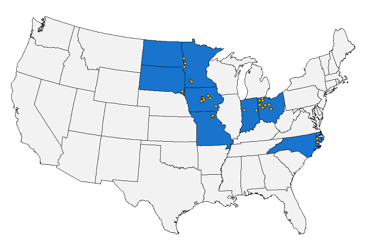

# TRANSFORMING DRAINAGE

[Transforming Drainage](https://transformingdrainage.org/) (TD) Project is a multi-state research, extension, and education effort aimed at addressing important drainage water management questions. It brings together data from 42 research sites across 8 states that span field- and plot-level scale experiments in an intensively standardized and quality controlled format. The project was funded from 2015-2020 by the United States Department of Agriculture, National Institute of Food and Agriculture (USDA-NIFA, Award No. 2015-68007-23193). 

## Data

TD data has been mainly stored in standardized Google Sheets. Some spreadsheets have been modified to accommodate special needs of the data provided (such as [WRSIS](https://www.ars.usda.gov/midwest-area/columbus-oh/soil-drainage-research/people/barry-allred/wetland-reservoir-subirrigation-system-wrsis/) data). Sheet have been downloaded to the local disk before reading and organized by data categories:

* [AGR](Input_Data/README_AGR.md)
* SOIL
* WATER
* WEATHER
* OTHER
* Metadata

The date when the Google Sheet is downloaded from the Google Drive is logged into a file 'log.csv' along with the date when the Google Sheet was updated. 

  